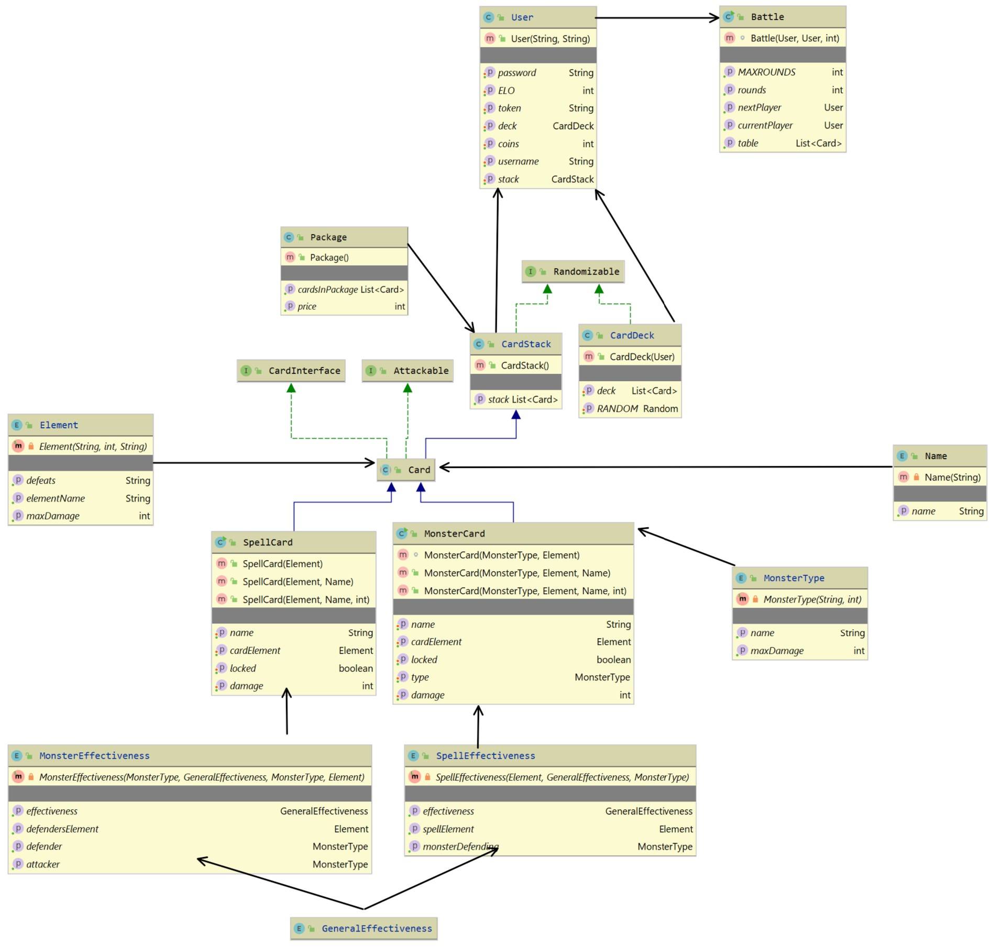

# Monster Trading Card Game

## Technical steps
###1) Game structure definition: Interfaces, Classes, Parameter, Enum, Parameters.

- Separation of the project in 2 main sections: game, server.
- Interfaces which define with functionality the program and its classes need to achieve.

###2) Unit test for TDD

###3) Server structure definition: Server, RequestContext, RequestHandler, Response, Controllers

- Connection using websockets and basic authentication.
- 

###4) Endpoints definition in RequestHandler

- Accordingly to URL/Path and HttpMethod.
- Error handling in case of unauthorized access.

###5) Allow threads in the server to handle multiple client requests

- Implement threads and make collections and variables thread safe. To prevent race condition.

###6) Creation of DB and tables for data persistence

- Creation of tables and db structure for persistence of data.
- Tables: card, session, trade, user

###7) Definition of trading system based on requirements

- Simple comparison between offered card features and card being traded.

###8) Election of collections

a) `Map`s: for storing key-value pairs `Hashmap<Key,Value>`
    
- Http request header.
- Map Card's class to Json.

b) `List`s:

- Stack, deck, and many other list of objects in general.
- `ArrayBlockingQueue<User>` for add 2 player to the same battle.
This collection gives access to extra methods like: pop(), 

c) Arrays

- `String[]` Strings of array for spliting URL

## Design

### 1) Diagrams

### Game

Original
 

Final

### Server

### Server

### 2) Structure
Division of project into 2 main section:
- Game
- Server

### Failures
1) Problem 1:
   
Try to modify simultaneously gameController in GameServer
If a request hasn't been finished another request from a different client won't be run until the first one is finished.

Solution: Threading

2) Problem 2:
   
Couldn't parse with jackson directly to the wanted class.

Solution: Create ClassData classes (package serializer), which won't have constructors (Compiler error) 

### Selected solutions

### Unit tests 

chosen and why the tested code is critical

### Integration test

### Time tracking

~ 130-150 hrs

### Git-history

https://github.com/MarianGP/SWE1-MTCG

